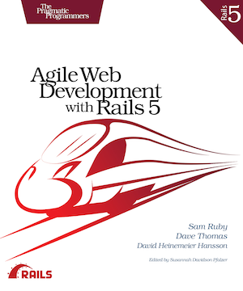

[](https://gitpitch.com/enogrob/ebook-project/master)
```
Roberto Nogueira  
BSd EE, MSd CE
Solution Integrator Experienced - Certified by Ericsson
```
# eBook Agile Web Development with Rails 5



**About**

Learn everything you need to about the subject of this `eBook` project.

[Homepage](https://pragprog.com/book/rails5/agile-web-development-with-rails-5)

## Topics
```
Foreword to the Rails 5 Edition
Preface to the Rails 5 Edition
Acknowledgments
Introduction
[x] Rails Simply Feels Right
[x] Rails Is Agile
[x] Who This Book Is For
[x] How to Read This Book
Part I. Getting Started
1. Installing Rails
[x] Installing on Cloud9
[x] Installing on a Virtual Machine
[x] Installing on Windows
[x] Installing on Mac OS X
[x] Installing on Linux
[x] Choosing a Rails Version
[x] Setting Up Your Development Environment
[x] Rails and Databases
2. Instant Gratification
[x] Creating a New Application
[x] Hello, Rails!
[x] Linking Pages Together
[x] When Things Go Wrong
3. The Architecture of Rails Applications
[x] Models, Views, and Controllers
[x] Rails Model Support
[x] Action Pack: The View and Controller
4. Introduction to Ruby
[x] Ruby Is an Object-Oriented Language
[x] Data Types
[x] Logic
[x] Organizing Structures
[x] Marshaling Objects
[x] Pulling It All Together
[x] Ruby Idioms
Part II. Building an Application
5. The Depot Application
[x] Incremental Development
[x] What Depot Does
[x] Let’s Code
6. Task A: Creating the Application
[x] Iteration A1: Creating the Product Maintenance Application
[x] Iteration A2: Making Prettier Listings
7. Task B: Validation and Unit Testing
[x] Iteration B1: Validating!
[x] Iteration B2: Unit Testing of Models
8. Task C: Catalog Display
[x] Iteration C1: Creating the Catalog Listing
[ ] Iteration C2: Adding a Page Layout
[ ] Iteration C3: Using a Helper to Format the Price
[ ] Iteration C4: Functional Testing of Controllers
[ ] Iteration C5: Caching of Partial Results
9. Task D: Cart Creation
[ ] Iteration D1: Finding a Cart
[ ] Iteration D2: Connecting Products to Carts
[ ] Iteration D3: Adding a Button
10. Task E: A Smarter Cart
[ ] Iteration E1: Creating a Smarter Cart
[ ] Iteration E2: Handling Errors
[ ] Iteration E3: Finishing the Cart
11. Task F: Add a Dash of Ajax
[ ] Iteration F1: Moving the Cart
[ ] Iteration F2: Creating an Ajax-Based Cart
[ ] Iteration F3: Highlighting Changes
[ ] Iteration F4: Hiding an Empty Cart
[ ] Iteration F5: Broadcasting Updates with Action Cable
12. Task G: Check Out!
[ ] Iteration G1: Capturing an Order
[ ] Iteration G2: Atom Feeds
13. Task H: Sending Mail
[ ] Iteration H1: Sending Confirmation Emails
[ ] Iteration H2: Integration Testing of Applications
14. Task I: Logging In
[ ] Iteration I1: Adding Users
[ ] Iteration I2: Authenticating Users
[ ] Iteration I3: Limiting Access
[ ] Iteration I4: Adding a Sidebar, More Administration
15. Task J: Internationalization
[ ] Iteration J1: Selecting the Locale
[ ] Iteration J2: Translating the Storefront
[ ] Iteration J3: Translating Checkout
[ ] Iteration J4: Add a Locale Switcher
16. Task K: Deployment and Production
[ ] Iteration K1: Deploying with Phusion Passenger and MySQL
[ ] Iteration K2: Deploying Remotely with Capistrano
[ ] Iteration K3: Checking Up on a Deployed Application
17. Depot Retrospective
[ ] Rails Concepts
[ ] Documenting What We’ve Done
Part III. Rails in Depth
18. Finding Your Way Around Rails
[ ] Where Things Go
[ ] Naming Conventions
19. Active Record
[ ] Defining Your Data
[ ] Locating and Traversing Records
[ ] Creating, Reading, Updating, and Deleting (CRUD)
[ ] Participating in the Monitoring Process
[ ] Transactions
20. Action Dispatch and Action Controller
[ ] Dispatching Requests to Controllers
[ ] Processing of Requests
[ ] Objects and Operations That Span Requests
21. Action View
[ ] Using Templates
[ ] Generating Forms
[ ] Processing Forms
[ ] Uploading Files to Rails Applications
[ ] Using Helpers
[ ] Reducing Maintenance with Layouts and Partials
22. Migrations
[ ] Creating and Running Migrations
[ ] Anatomy of a Migration
[ ] Managing Tables
[ ] Advanced Migrations
[ ] When Migrations Go Bad
[ ] Schema Manipulation Outside Migrations
23. Nonbrowser Applications
[ ] A Stand-Alone Application Using Active Record
[ ] A Library Function Using Active Support
24. Rails&#8217; DependenciesRails’ Dependencies
[ ] Generating XML with Builder
[ ] Generating HTML with ERB
[ ] Managing Dependencies with Bundler
[ ] Interfacing with the Web Server with Rack
[ ] Automating Tasks with Rake
[ ] Survey of Rails’ Dependencies
25. Rails Plugins
[ ] Credit Card Processing with Active Merchant
[ ] Beautifying Our Markup with Haml
[ ] Pagination
[ ] Additional Plugins worth Exploring
26. Where to Go from Here
A1. Bibliography
```
